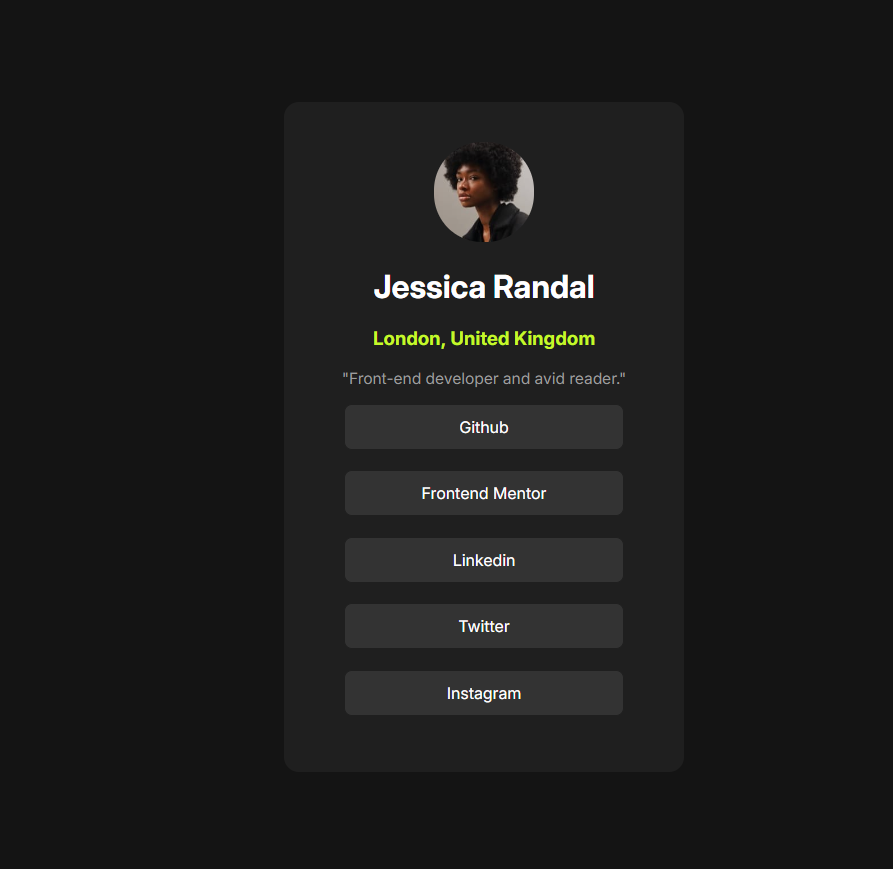

# Projeto Simples de Cartão de Visita

Este projeto é um cartão de visita simples desenvolvido com HTML e CSS. Ele exibe informações básicas de contato e links para redes sociais ou portfólios em um design elegante e responsivo.

Este projeto foi inspirado em um desafio do [Frontend Mentor](https://www.frontendmentor.io/), uma plataforma que oferece projetos para aprimorar habilidades em desenvolvimento front-end.

## Visualização



## Tecnologias Utilizadas

- **HTML5**: Estrutura do conteúdo.
- **CSS3**: Estilização e layout responsivo.

## Como Usar

### Pré-requisitos

Para visualizar este projeto, você só precisa de um navegador da web moderno.

### Passos

1. **Clone o repositório**:

   ```bash
   git clone https://github.com/luisfelipecode/social-links.git
